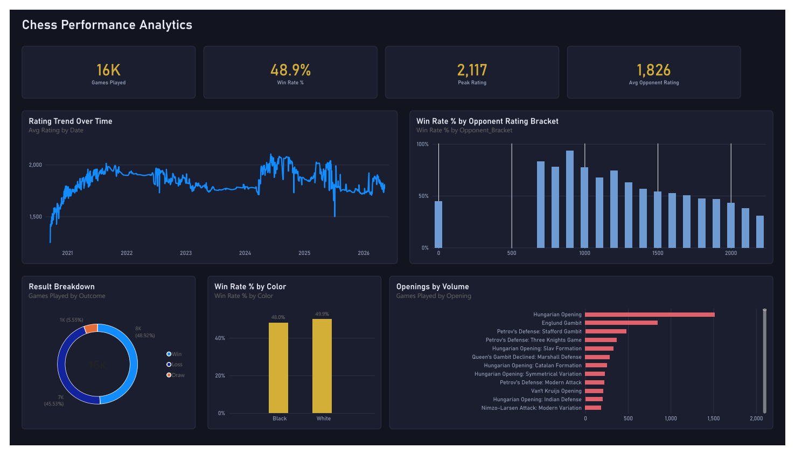

# Chess Game Performance Analysis ♟️📊

An Information Engineering approach to analyzing personal chess history. This project processes raw PGN data from Lichess into a structured format to identify strategic strengths, rating growth, and skill plateaus.

## 🚀 Overview
This repository contains a Python-based pipeline that transforms thousands of chess games into actionable insights. By extracting metadata from PGN files, we can visualize performance across different opening systems and rating brackets.

## 🛠️ Tech Stack
- **Language:** Python 3.12
- **Libraries:** Pandas (data manipulation), python-chess (PGN parsing)
- **Visualization:** Power BI (DAX measures over `processed_chess_data.csv`)

## 📁 Repository Structure
- `analyze_games.py`: Parses raw PGN data into `processed_chess_data.csv`.
- `processed_chess_data.csv`: The cleaned, feature-engineered dataset — opening, color, rating, opponent bracket, and score per game.
- `my_chess_games_analyzed.pbip` + `.Report/` + `.SemanticModel/`: the Power BI project (below).

## 🔧 How to Use
1. `pip install -r requirements.txt`
2. Download your PGN file from Lichess, then set `MY_USERNAME` and `FILE_NAME` in `analyze_games.py`.
3. `python analyze_games.py` — parses the PGN into `processed_chess_data.csv`.

## 🖥️ The Dashboard

`my_chess_games_analyzed.pbip` (open with Power BI Desktop — File → Open → the
`.pbip` file; it pulls straight from `processed_chess_data.csv`, so it stays
in sync every time that CSV is regenerated). Dark navy/gold theme, Bahnschrift
throughout, one page.

A static export (`my_chess_games_analyzed.png`) lives alongside the `.pbip`
for anyone without Power BI Desktop.

**KPI strip:** Games Played, Win Rate, Peak Rating, and Avg Opponent Rating —
the last one giving Win Rate its comparative context (am I beating stronger
or weaker opposition on average?). Below that: a monthly rating trend, win
rate by 100-point opponent bracket, a result-outcome donut, win rate by
color, and a top-openings chart (volume vs. win rate across the repertoire).
