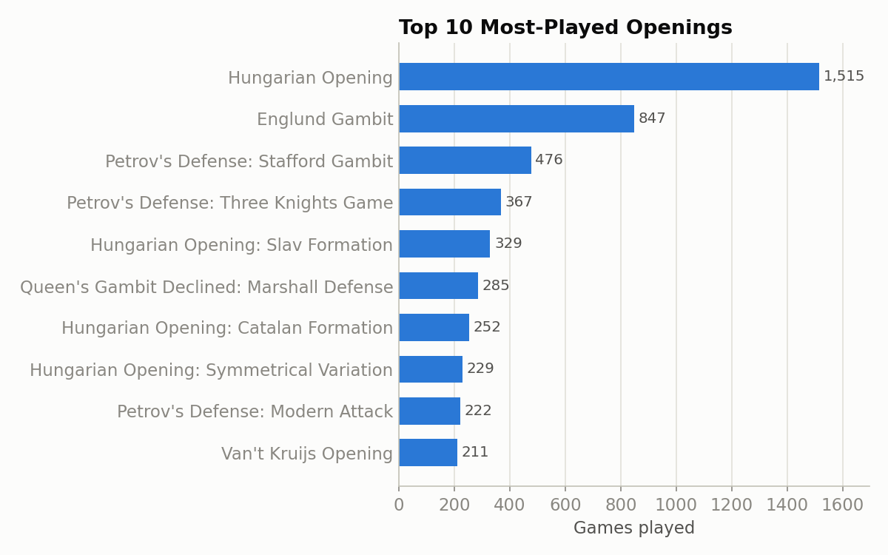

# Chess Game Performance Analysis ♟️📊

An Information Engineering approach to analyzing personal chess history. This project processes raw PGN data from Lichess into a structured format to identify strategic strengths, rating growth, and skill plateaus.

## 🚀 Overview
This repository contains a Python-based pipeline that transforms thousands of chess games into actionable insights. By extracting metadata from PGN files, we can visualize performance across different opening systems and rating brackets.

## 🛠️ Tech Stack
- **Language:** Python 3.12
- **Libraries:** Pandas (data manipulation), python-chess (PGN parsing), Matplotlib (visualization)

## 📁 Repository Structure
- `analyze_games.py`: Parses raw PGN data into `processed_chess_data.csv`.
- `generate_charts.py`: Builds every chart below from that CSV.
- `processed_chess_data.csv`: The cleaned, feature-engineered dataset.
- `/visualizations`: The generated charts.

## 🔧 How to Use
1. `pip install -r requirements.txt`
2. Download your PGN file from Lichess, then set `MY_USERNAME` and `FILE_NAME` in `analyze_games.py`.
3. `python analyze_games.py` — parses the PGN into `processed_chess_data.csv`.
4. `python generate_charts.py` — regenerates every chart in `/visualizations`.

## 📊 Data Visualizations

### 1. Opening Volume
Which openings actually get played, by raw game count.

### 2. Opening Repertoire Strength
Volume vs. win rate for the top 15 openings — the gap between "played most" and "played best."

### 3. ELO Evolution Curve
Monthly average rating from first tracked game to present.

### 4. Skill Ceiling Analysis
Win rate by 100-point opponent rating bracket — where the win rate crosses 50% marks the current competitive ceiling.

### 5. Color Performance Comparison
Win rate as White vs. Black.

