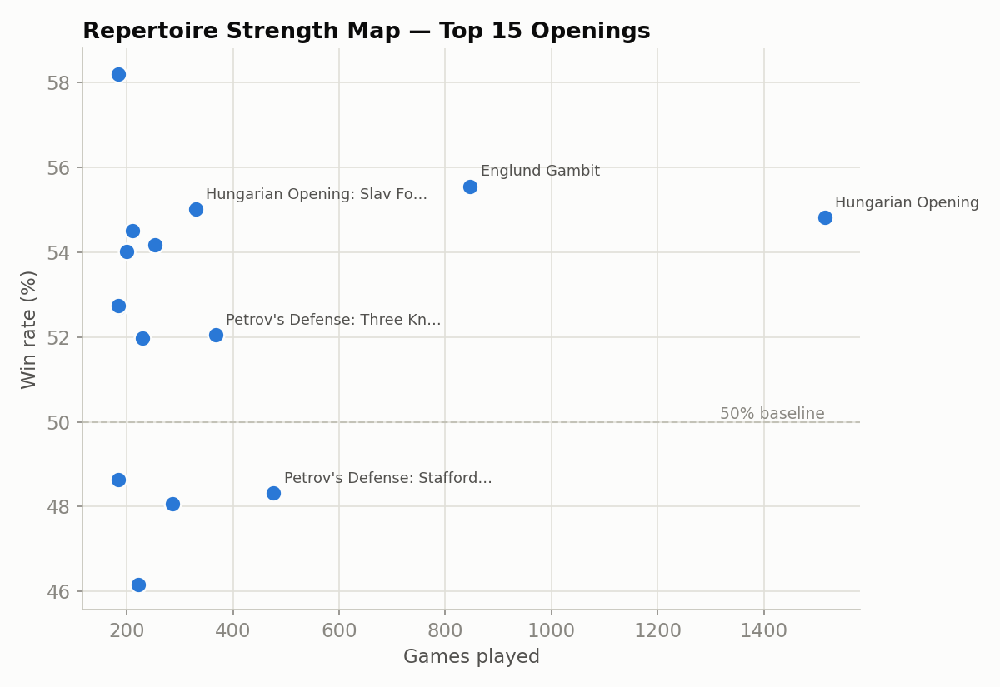
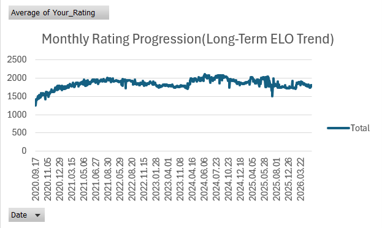
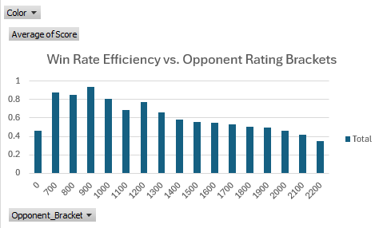
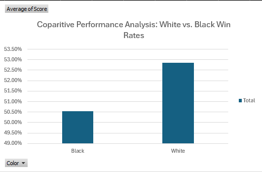

# Chess Game Performance Analysis ♟️📊

An Information Engineering approach to analyzing personal chess history. This project processes raw PGN data from Lichess into a structured format to identify strategic strengths, rating growth, and skill plateaus.

## 🚀 Overview
This repository contains a Python-based pipeline that transforms thousands of chess games into actionable insights. By extracting metadata from PGN files, we can visualize performance across different opening systems and rating brackets.

## 🛠️ Tech Stack
- **Language:** Python 3.14.4
- **Libraries:** Pandas (Data Manipulation), Python-Chess (PGN Parsing)
- **Visualization:** Excel Pivot Tables & Charts

## 📁 Repository Structure
- `analyze_games.py`: The core processing script that cleans data and performs feature engineering.
- `processed_chess_data.csv`: The cleaned dataset ready for visualization.
- `/visualizations`: High-resolution charts showing key performance metrics.

## 📈 Key Insights
1. **Opening Efficiency:** A detailed look at the Top 10 openings by volume and win rate.
2. **ELO Progression:** Monthly rating averages to show long-term improvement trends.
3. **Skill Ceiling:** Win-rate analysis categorized by opponent rating brackets.
4. **Color Advantage:** Statistical comparison of White vs. Black performance.

## 🔧 How to Use
1. Download your PGN file from Lichess.
2. Update the `MY_USERNAME` and `FILE_NAME` variables in `analyze_games.py`.
3. Run the script to generate the `processed_chess_data.csv`.
4. Use the CSV to generate pivot tables and charts.

## 📊 Data Visualizations

### 1. Opening Repertoire Strength
Analyzing the Top 10 most played openings to determine win/loss distribution and reliability.

### 2. ELO Evolution Curve
A monthly time-series analysis showing the rating progression from initial levels to current standing.

### 3. Skill Ceiling Analysis
Win-rate efficiency categorized by 100-point opponent rating brackets to identify the current competitive limit.

### 4. Color Performance Comparison
Statistical breakdown of win rates playing as White vs. Black.

